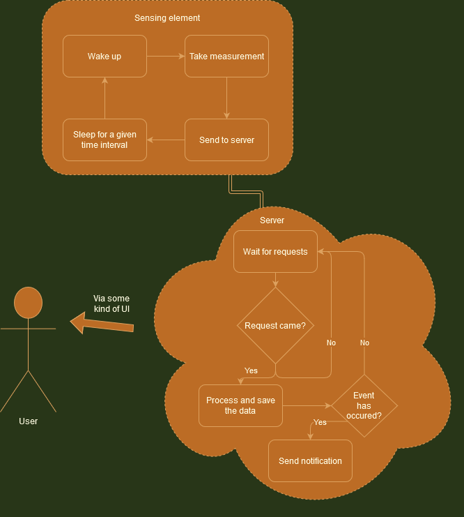
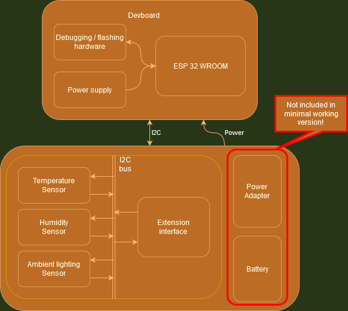

# EmbeddedSensorApplications - Terrarium Monitoring Device (TMD)

## The purpose of this repository

This repository is used to develop, test and contain designs for device (or whole system) used for monitoring environmental conditions in a terrarium - at least that is the intended usage.

## Behavioural model of the system

On the highest abstraction level, the system works as follows:

 - There is a sensing element, comprised of several sensors and a MCU managing them,
 - Sensing element takes the measurements in some specified time intervals,
 - The measurement outcome is processed and logged onto a server,
 - The server can notify the user in case that some event occurs (triggered by i.e. the measurement values) or just store the data,
 - The user has access to the stored data via some kind of interface.

As one can see, the above description is pretty vague, and that is because the time to develop this system is really limited - as such, some elements of the design may not be fully developed and only delivered as proof-of-concept or not implemented at all. All the details and requirements will be described below.

## Structural model of the system

### Sensing element

As mentioned above, the sensing element will be comprised of two main components: MCU and sensors board. As the MCU of choice, ***ESP WROOM 32*** was picked - all the embedded software shall be written with that platform in mind. Hosting this ESP module shall be one of many available development boards - the exact pinout and kind of board will be provided later.

Sensors shall be part of another board, which will be custom-made for this project. In the absolute minimum version, three parameters shall be measured:

 - Relative humidity,
 - Absolute temperature,
 - Ambient lighting.

The exact requirements for each parameter measurement are defined ***here***. \# TODO: Add a link to another markdown file with reqs.

The board containing the sensors shall be designed so that it could be easily extended in the future - for example, via 2.54mm gold pins (connection type is not a requirement - only the possibility of connection itself).

In the minimal working version, module shall be powered from external source via mini USB provided on the devboard. As seen on above diagram, plans for battery power exist for the future, but because of much added cost and complexity this option will not be implemented for now.

If the time allows, a custom-made cover for the whole sensing element will be made.

### Server

\# WIP!

